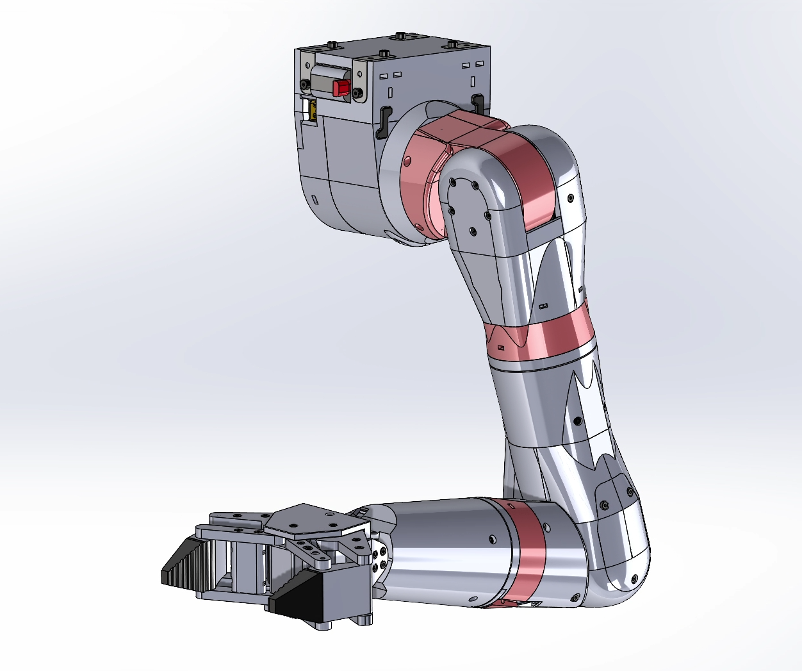
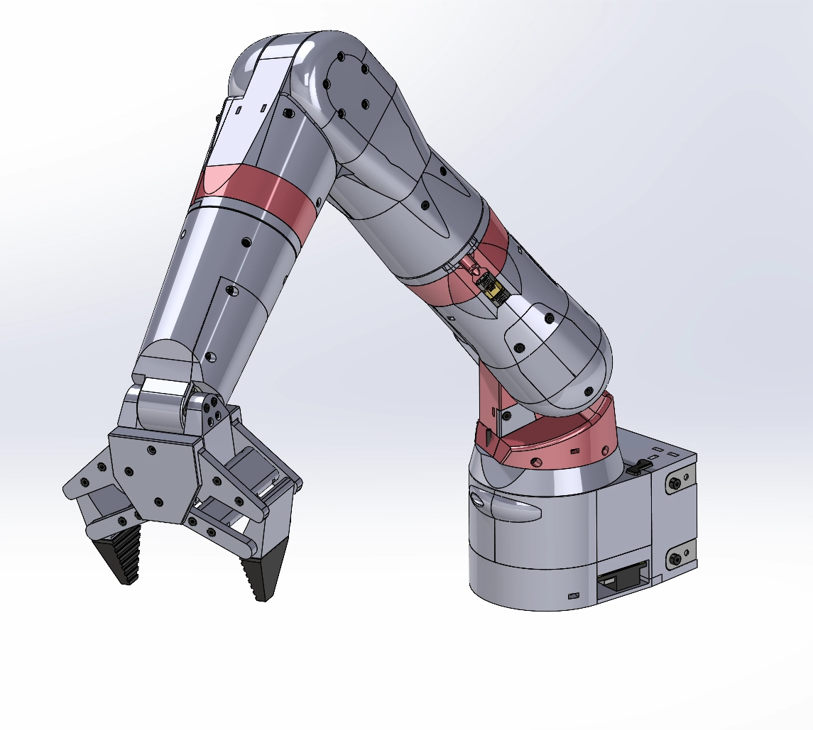
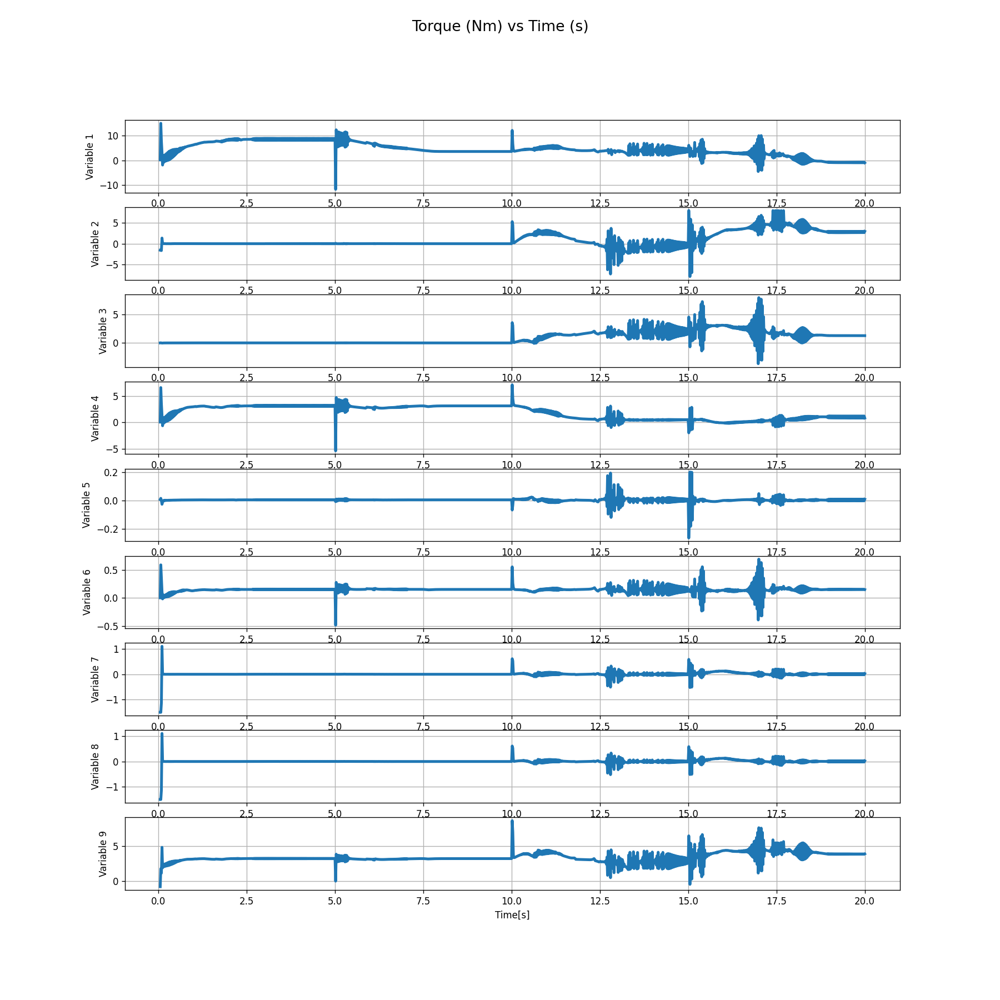
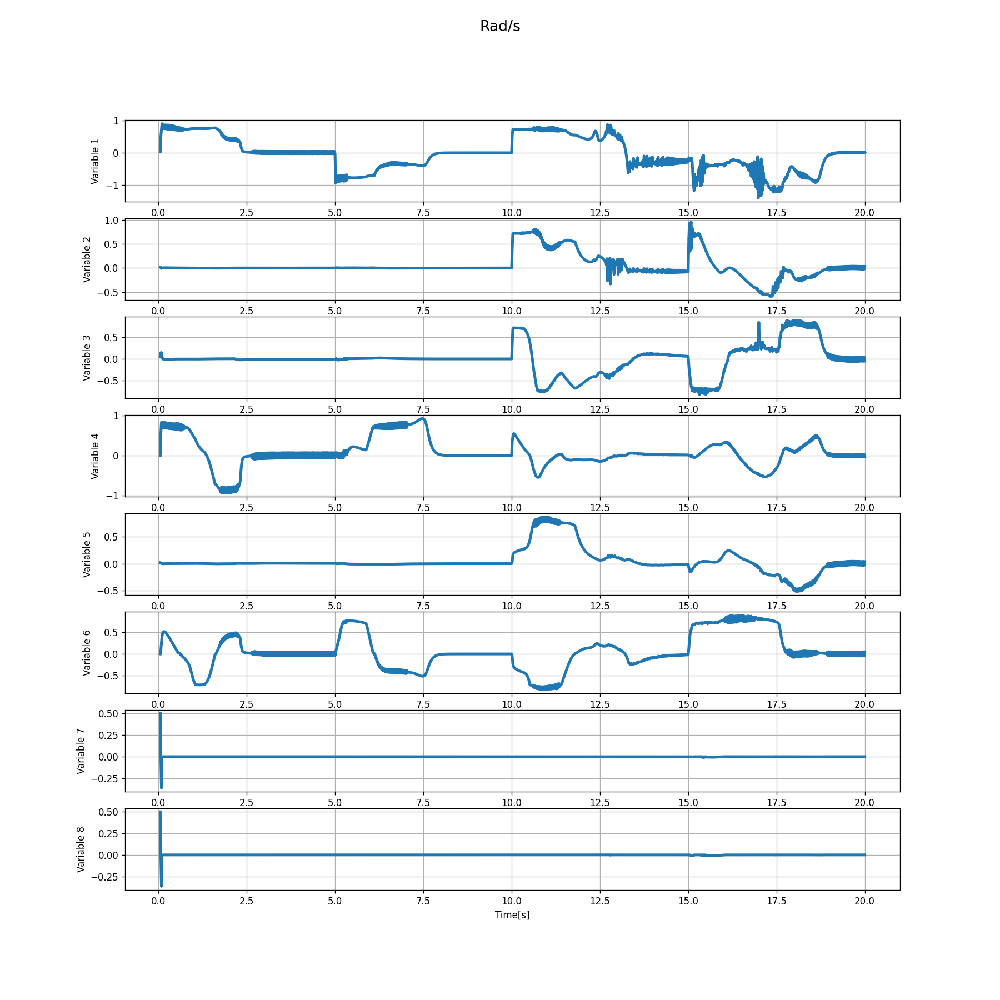
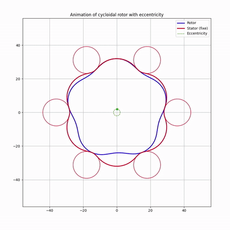
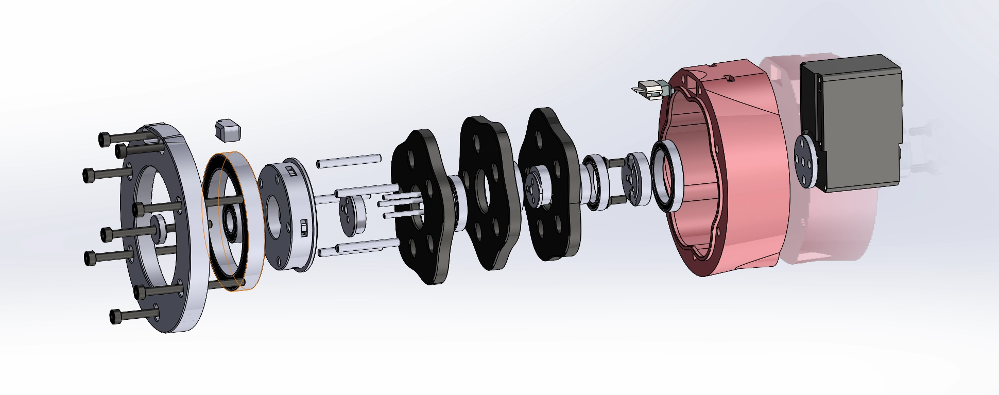
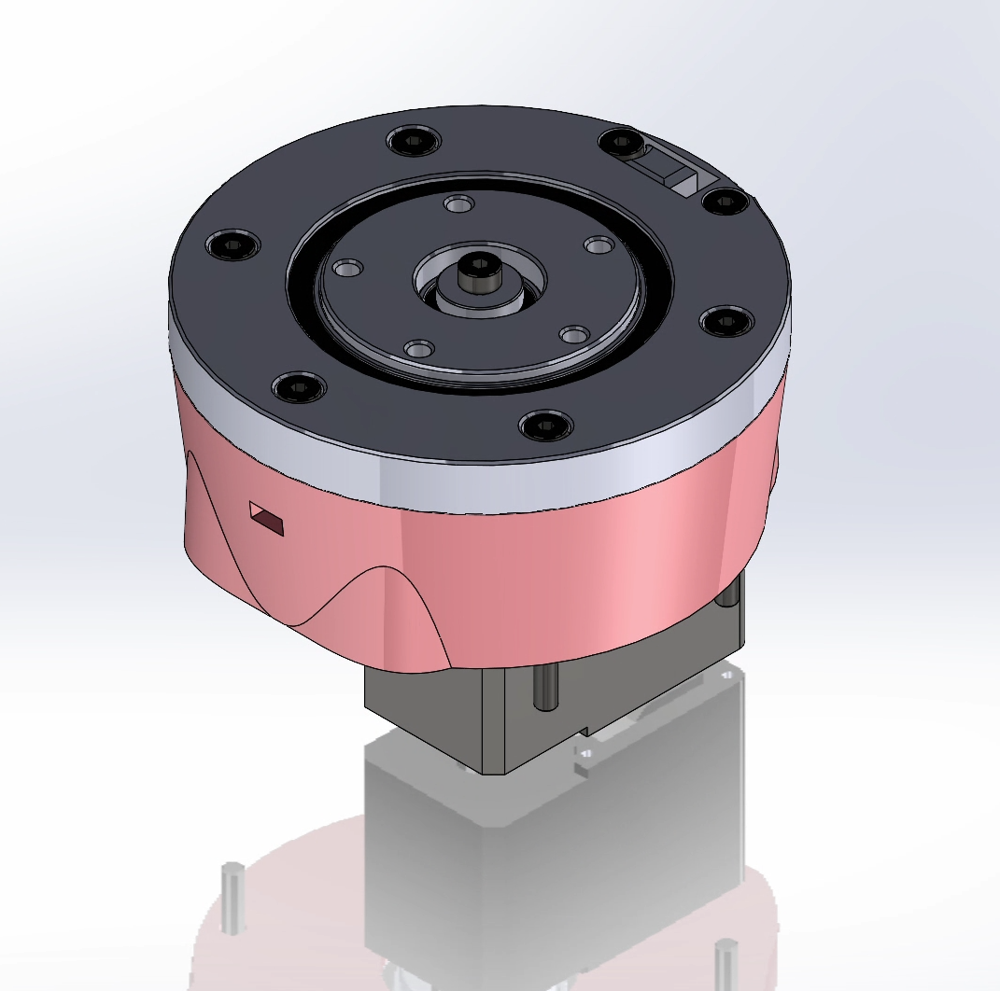
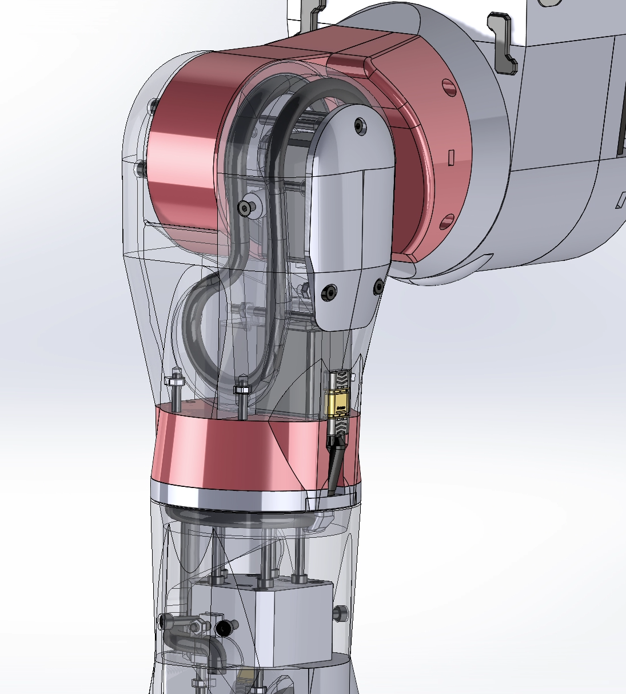

# Robotic Arm

  

## Overview

This Robotic Arm is designed to perform simple to complex manipulative tasks, enabling the implementation of AI models. The arm is scaled to human proportions and designed to be cost-effective, with all parts 3D printed.

The arm can be used both vertically, like a human arm, or horizontally, like a traditional DOF robot. It only needs to be connected to a computer through the USB-C port.

  
  

## Sourcing Parts

Detailed part costs and links are shown below. Some links may provide more than the necessary quantity. You can find the complete Bill of Materials (BOM) in the repository files. 

Please note, you need to add the cost of the 3D printed parts to this list.

> Only EU costs and availability have been calculated.

### Parts to buy : 

| Description | Supplier | Quantity | Unit Price (EUR) | Total Price (EUR) | Link |
|-------------|----------|----------|----------------|----------------|------|
| Servo Feetech STS3215 | Alibaba | 7 | 13 | 91 | [Alibaba](https://docs.google.com/spreadsheets/d/1NSq1UUoz3DjgiEBvVC6gFn5Jqz1jVz-hb513ZOTMuxQ/edit?gid=1762389364#gid=1762389364) |
| Waveshare Serial Bus Servo Driver Board | Amazon | 1 | 11.99 | 11.99 | [Amazon](https://www.amazon.fr/dp/B0CJ6TP3TP) |
| LiPo Roaringtop 2200mAh 35C, 2pcs | Amazon | 1 | 32.1 | 32.1 | [Amazon](https://www.amazon.fr/dp/B08H82KFS6/ref=twister_B09YHFFBK1?_encoding=UTF8&th=1) |
| Universal Lithium Grease | Amazon | 1 | 7.99 | 7.99 | [Amazon](https://www.amazon.fr/dp/B008ETHDPO) |
| Hex Screw M3 Socket Cap, Box | Amazon | 1 | 10.59 | 10.59 | [Amazon](https://www.amazon.fr/dp/B093GNHWKR) |
| Bearing 20x27x4, 6704 2RS, 5pcs | Aliexpress | 1 | 4.61 | 4.61 | [Aliexpress](https://fr.aliexpress.com/item/1005006822777675.html) |
| Bearing 8x16x5, 688ZZ, 10pcs | Aliexpress | 1 | 1.75 | 1.75 | [Aliexpress](https://fr.aliexpress.com/item/1005007235103277.html) |
| Bearing 40x52x7, 6808-2RS, 2pcs | Aliexpress | 2 | 3.51 | 7.02 | [Aliexpress](https://fr.aliexpress.com/item/1005007420073930.html) |
| Bearing 15x21x4, 6702ZZ, ABEC 1, 10pcs | Aliexpress | 2 | 3.43 | 6.86 | [Aliexpress](https://fr.aliexpress.com/item/4000909621264.html) |
| Bearing 50x65x7, 6810-2RS, 2pcs | Aliexpress | 2 | 5.09 | 10.18 | [Aliexpress](https://fr.aliexpress.com/item/1005007420073930.html) |
| Wire AWG16 3 Core, 3m | Aliexpress | 1 | 10.39 | 10.39 | [Aliexpress](https://fr.aliexpress.com/item/1005006405984242.html) |
| Hex Socket M3 Countersunk Flat Head Screw, 8mm, 50pcs | Aliexpress | 1 | 1.66 | 1.66 | [Aliexpress](https://fr.aliexpress.com/item/4001199728978.html) |
| Hex Socket M3 Countersunk Flat Head Screw, 10mm, 50pcs | Aliexpress | 1 | 1.75 | 1.75 | [Aliexpress](https://fr.aliexpress.com/item/4001199728978.html) |
| Hex Socket M3 Countersunk Flat Head Screw, 12mm, 50pcs | Aliexpress | 1 | 1.84 | 1.84 | [Aliexpress](https://fr.aliexpress.com/item/4001199728978.html) |
| Hex Socket M3 Countersunk Flat Head Screw, 16mm, 50pcs | Aliexpress | 1 | 2.04 | 2.04 | [Aliexpress](https://fr.aliexpress.com/item/4001199728978.html) |
| Dowel Pin M2, 20mm, 20pcs | Aliexpress | 1 | 1.3 | 1.3 | [Aliexpress](https://fr.aliexpress.com/item/1005007218328914.html) |
| Dowel Pin M3, 30mm, 20pcs | Aliexpress | 1 | 2.69 | 2.69 | [Aliexpress](https://fr.aliexpress.com/item/1005007023343232.html) |
| Dowel Pin M3, 25mm, 20pcs | Aliexpress | 1 | 2.55 | 2.55 | [Aliexpress](https://fr.aliexpress.com/item/1005007023343232.html) |
| Dowel Pin M3, 16mm, 20pcs | Aliexpress | 1 | 2.06 | 2.06 | [Aliexpress](https://fr.aliexpress.com/item/1005007023343232.html) |
| AMASS MR30 Pair Male+Female, 10pcs | Aliexpress | 1 | 6.61 | 6.61 | [Aliexpress](https://fr.aliexpress.com/item/1005005485789207.html) |
| Heat Shrink Tube, Box 127pcs | Aliexpress | 1 | 2.24 | 2.24 | [Aliexpress](https://fr.aliexpress.com/item/1005001787291963.html) |
| Allen Hexagon Head Screws M4 20mm, 10pcs | Aliexpress | 1 | 1.36 | 1.36 | [Aliexpress](https://fr.aliexpress.com/item/32442183034.html) |
| Allen Hexagon Head Screws M4 40mm, 10pcs | Aliexpress | 1 | 1.88 | 1.88 | [Aliexpress](https://fr.aliexpress.com/item/32442183034.html) |
| M4 Nuts Hexa, 25pcs | Aliexpress | 1 | 1.38 | 1.38 | [Aliexpress](https://fr.aliexpress.com/item/32977174437.html) |
| Hex Socket M2.5 Countersunk Flat Head Screw, 12mm, 50pcs | Aliexpress | 1 | 1.65 | 1.65 | [Aliexpress](https://fr.aliexpress.com/item/4001199728978.html) |
| Hex Socket M3 Countersunk Flat Head Screw, 25mm, 50pcs | Aliexpress | 1 | 2.59 | 2.59 | [Aliexpress](https://fr.aliexpress.com/item/4001199728978.html) |
| Hex Socket M3 Socketcap Head Screw, 45mm, 50pcs | Aliexpress | 1 | 3.80 | 3.80 | [Aliexpress](https://fr.aliexpress.com/item/32442183034.html) |
| XT60 Male Connector | Aliexpress | 1 | 1.59 | 1.59 | [Aliexpress](https://fr.aliexpress.com/item/1005006840459578.html) |
| Lipo Battery Charger | Aliexpress | 1 | 5.01 | 5.01 | [Aliexpress](https://fr.aliexpress.com/item/1005007620618797.html) |
| MR30 male and female connector, 10pcs | Aliexpress | 1 | 6.59 | 7.99 | [Aliexpress](https://fr.aliexpress.com/item/1005005485789207.html) |
| **Total** |  |  |  | **246.96** | |

> Make sure the AWG 16, 3-core wire outside diameter is equal to or less than 7mm.

### 3D Printed Parts

All the 3D printed parts can be found in the `/STEP` folder.  For main assembly, open `Bionic_arm.STEP`
Parts have been tested with an Artillery SW-X4 Plus printer.

## Specifications

This arm is first designed as a human arm. It has a 1:1 scale and the same joint amplitude :

- The arm needs to be able to lift a 500g object.
- End-effector position error must be < 1 cm.
- The arm must be able to pick up an object from any orientation within its kinematic workspace.
- Actuator velocity must be fast enough to perform a task at a reasonable speed. Full amplitude < 4s.

### Joint Amplitude:

| Joint       | Min  | Max  | Amplitude |
|-------------|------|------|-----------|
| Shoulder Y | -90  | 180  | 270       |
| Shoulder X | -20  | 150  | 170       |
| Upper Z    | -180 | 90   | 270       |
| Elbow Y    | -60  | 110  | 170       |
| Forearm Z  | -90  | 90   | 180       |
| Wrist Y    | -60  | 60   | 120       |

A first draft was made in Isaac Sim to determine the required specifications for the actuators:
- Joints were placed in the same positions as a human arm.
- The final robot mass was approximated for each rigid body.
- A 500g load was added to the gripper mass to simulate the payload.

Lula RMPflow controller is used, with different positions given while joint effort and velocity are recorded:

  

  
  

### The minimum actuator specifications required are:
- **10 Nm** for the first shoulder joint, **5 Nm** for the rest.
- **≥ 1 rad/s** velocity.

**STS3215** serial servo (3 Nm, 5.5 rad/s, 12V) has been selected for all the joints.

**STS3215** serial servo allows easier wire management, position/velocity/torque feedback, and features a multi-turn encoder.  
A cycloidal drive will be coupled to the STS servo to achieve the desired torque.

## Cycloid Drive

The gearbox will be used with the Feetech STS3215 servomotors (30 kg·cm, 52 rpm / 5.5 rad/s), with a desired **5:1** gear ratio.  
The shape of the rotor and stator has been tuned using the Python script `cycloid_tuning.py`:  

| Parameter     | Value   | Description                          |
|--------------|---------|--------------------------------------|
| R            | 36 mm   | Pitch radius of fixed ring pins     |
| E            | 2 mm    | Eccentricity offset                 |
| Rr           | 8 mm    | Ring pin radius                     |
| N            | 6       | Number of ring pins                 |
| Sharpness    | 6.5 mm  | Pitch angle around stator ring pins |

  

This design aims to achieve the best torque distribution and minimize backlash.  
As both rotors and the housing are **3D printed**, a **three-rotor design** has been chosen.  
The Cycloid assembly can be open with `Cycloid_drive_default.STEP` in the `/STEP` folder.  

  
  

A load test has been conducted to measure output torque, speed, backlash, and efficiency:  

- **Output torque**: 8.5 Nm  
- **Output velocity**: 1.1 rad/s  
- **Backlash after load**: 0.5°  
- **Efficiency**: (8.5/3)/5 = **0.56** *(test were conducted without grease)*  

## Assembly

Use the main Assembly File for the main assembly `Bionic_arm.STEP`

> Wire length must be calculated by doing a full amplitude on the joint before soldering it.

**Upper and Middle Wire Management :**

  

## IsaacSim

### Manipulation Tasks (coming soon):

  

### RL (coming soon):

Reinforcement learning model with IsaacLab.

## Software (coming soon):

- ROS2 interface for the serial bus to allow easy export from simulation to real-world and run both together.
- Python script with embedded AI models.

